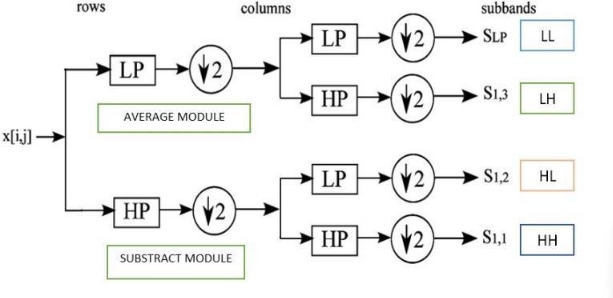
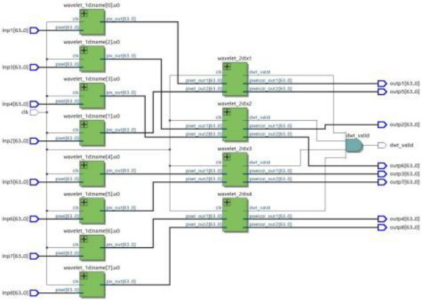
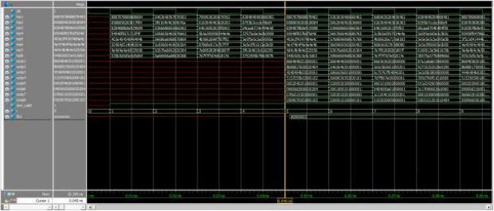
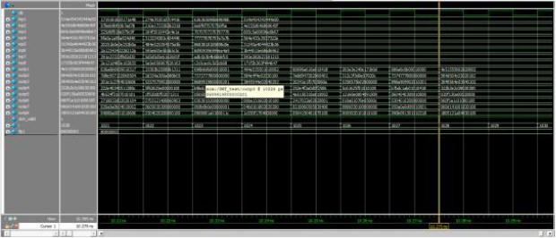
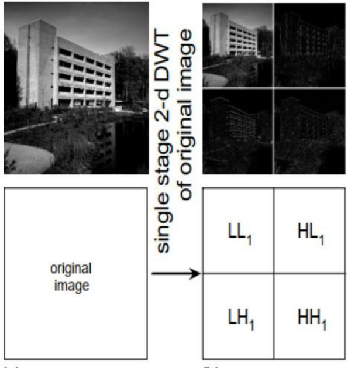
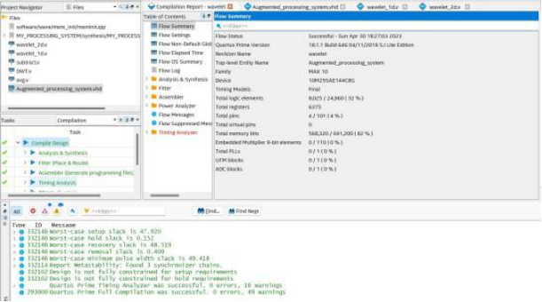

**Introduction**

Image compression is done using 2D discrete wavelet transform (DWT). DWT is one of the matrix based image transforms used for time frequency localization. DWT finds wide variety of applications like JPEG image compression, noise removal etc... It can be implemented simply using Haar wavelet basis function. The input image in 2D matrix form is first processed row wise and then processed column wise to obtain four subbands each corresponding to different image features. One of the subbands contains the compressed version of the input image.

The input image is first preprocessed using MATLAB and Python to convert the image into pixels and arrange them in the block format. Then the implementation is done in HDL and obtained the result hex file for postprocessing in MATLAB and Python.

DWT using Haar wavelet basis function can be simply implemented using two approaches. The two implementation techniques are completely different from each other. They are

- Matrix based implementation
- Filter bank implementation

Matrix based approach requires more hardware and is more expensive while filter bank approach uses basic logic elements and a simpler approach compared to matrix based approach.

Filter bank implementation requires the following modules to implement DWT

- Averaging module (acts as low pass filter to obtain the smoothening coefficients)
- Subtraction module (acts as high pass filter to obtain the detailing coefficients)
- 1D wavelet module (for row wise processing)
- 2D wavelet module (for column wise processing)
- 2D DWT module (integration of all sub modules to form the final filter bank architecture)

Filter Bank Architecture

**Weekly Milestones**

- 1st Week
1. Literature Survey
1. Image Preprocessing

   The input image is taken from image library and first it is preprocessed in MATLAB to convert the given image of 256 X 256 pixels into hex file where pixel extraction is done and it outputs a hex file with 65536 pixel values. This hex file is given as input to the Python program which arranges the pixels in block format. Each block contains 8 rows and each row consists of 8 pixels. The final hex file contains 8192 rows each of 8 pixels. This will be given as an input to our HDL implementation.

3. HDL Implementation of Averaging and Subtraction module

   The averaging module has two 8 bit inputs and one 8 bit output. The inputs are first right shifted and then added which performs the average operation. The output is registered at the positive edge of the clock cycle.

*Averagemodule* = (*pixel*1 + *pixel*2)*/*2

The subtraction module has two 8 bit inputs and one 8 bit output. The inputs are first right shifted and then subtracted which performs the subtraction operation. The output is registered at the positive edge of the clock cycle.

*Suntractmodule* = (*pixel*1 *− pixel*2)*/*2

2
- 2nd Week
1. Implementation of 1D wavelet and 2D wavelet module

   The 1D wavelet module receives 64 bit inputs (a row with 8 pixels). The successive pixels in each row are averaged and subtracted and the averaging results are placed in first four columns and the subtraction results are placed in last four columns. This completes the row processing and now the output contains ’L’ part in first four columns and ’H’ part in next four columns.

   The 2D wavelet module receives two 64 bit inputs (a row with 8 pixels) from the output of 1D wavelet module. The successive pixels in each column are averaged and subtracted and the averaging results are placed in first four rows and the subtraction results are placed in last four rows. This completes the column processing and now the output contains ’LL’ part in first quarter, ’LH’ part in the second quarter, ’HL’ part in the third quarter and ’HH’ part in the last quarter.

2. Implementation of DWT module and Modelsim Simulation

Hardwarw architecture

3

The top DWT module consists of all instantiations of the above modules. It takes eight rows each of eight pixels as input and also outputs eight rows as output. It consists of eight 1D wavelet module instantiations and four 2D wavelet module instantiations. Apart from this, there is also a DWT valid signal which enables writing the output into hex file.

Modelsim Simulation 1

Modelsim Simulation 2

4

3. Separation of Image sub-bands and Postprocessing

   The resultant hex file obtained from modelsim simulation is postprocessed using Python to arrange the obtained pixels again into image format and MATLAB to observe the compressed image. The compressed image consists of four subbands

   LL - Reduced version of our original image which contains most of the details. LH - Contains horizontal edge features

   HL - Contains vertical edge features

   HH - Contains high frequency information, typically noisy.

Image Compression

5
- 3rd Week
1. Using Platform Designer and its testing
1. Implementation on Xen10 FPGA board and Docklight terminal

   Using Eclipse for NIOS II and some specific BSP generator settings and compiling the design a Serial Vector File (.svf) generated which is dumped on FPGA using JTAG UART and the output is being printed on Docklight terminal using serial communication through UART implementing RS232 protocol.

Component utilization report

3. Image quality analysis and documentation

   The compressed image obtained is taken as an input and PSNR is found to observe the quality of the image, If the PSNR obtained is greater than 25dB, it indicates that the compressed image is of good quality else poorer.
6
